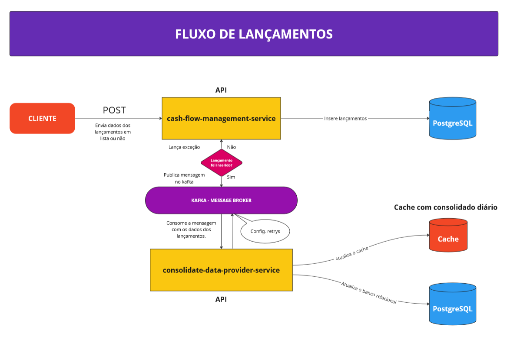
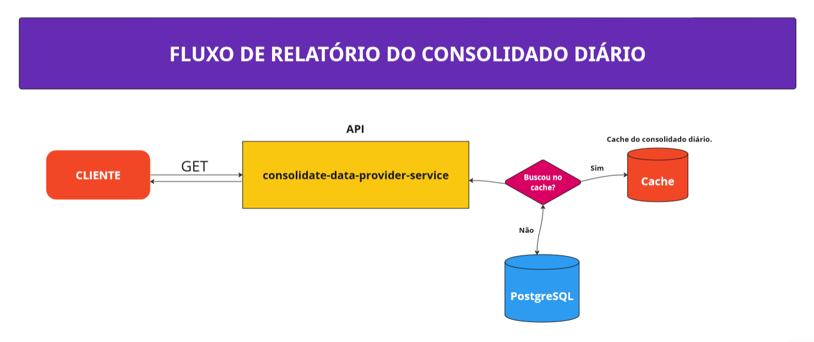

# Serviço de Lançamentos de Fluxo de Caixa

Serviço de lançamentos de fluxo de caixa com de atender um desafio técnico:

### Desafio da Solução

Um comerciante precisa controlar seu fluxo de caixa de caixa diário com lançamentos de débitos e créditos, também
precisa de um relatorio que disponibilize o saldo diário consolidado.

#### Requisitos de Negócio:

* Serviço que faça o controle de lançamentos.
* Serviço de consolidado diário

#### Requisitos técnicos:

* Desenho da solução
* Pode ser feito na linguagem que você domina
* Boas práticas são bem-vindas (Design Patterns, Padrões de arquiteura, SOLID, etc.)
* Readme com instruções de como subir a aplicação local, container e utilização dos serviços
* Hospedar em reposítório Público

## Descrição do Projeto

O projeto utiliza um serviço responsavel por receber as requisições de debito e credito via api rest e salvar os dados
no banco de dado e enviar dados para o kafka atuando como producer, para que outro serviço **consolidate-data-provider**
gere os saldo atuando como consumer.

### Versão Java

Foi utilizado o JDK 8 para o desenvolvimento deste teste.

### Frameworks

Foi utilizado como base do projeto o Spring Boot 2.7.12. Algumas bibliotecas adicionais, da própria suite do spring:

* **spring-boot-starter-data-jpa** - Core do Spring Boot para uso de JPA nos projetos
* **spring-boot-starter-web** - Core do Spring Boot para API's
* **spring-boot-starter-cloud** - Fornece uma série de ferramentas que facilitam a criação de aplicações distribuídas e
  escaláveis.
* **spring-boot-kafka** - Apache Kafka é uma plataforma popular de streaming de eventos usada para coletar, processar e
  armazenar dados de eventos de streaming ou dados que não têm início ou fim distintos.
* **spring-boot-devtools** - Utilitários do Spring Boot para desenvolvedores
* **org.postgresql** - Driver para postgres
* **hibernate-validator** - Biblioteca adicional do Hibernate para adicionar os validadores JPA do Hibernate
* **org.flywaydb** - Ferramenta para realizar *migrations* em bancos de dados, mantém os bancos atualizados em produção.

### Processamento assíncrono

Este projeto contem processamento assíncrono e usa o **kafka** para enviar os lançamentos para o microsserviço
que irá disponibilizar o saldo.

### Conteinerização

Foi configurado também para este projeto, um Dockerfile simples, que consiste em pegar o jar gerado pelo projeto, que já
é auto-executável, e embutir em uma imagem docker junto do openjdk 8. As imagens compiladas estão disponíveis
em: https://hub.docker.com/repository/docker/gustavoanalistabr/cash-flow-service

Para o ambiente de desenvolvimento, também está disponível um arquivo docker-compose, na pasta infra, que levanta os
serviços de banco de dados, kafka e do Kafdrop para acessar cliente do kafka.

### Swagger

Para acessar o swagger do projeto, basta executar o projeto e acessar a url: http://localhost:8094/swagger-ui.html. O
mesmo é dinâmico, gerado pelas anotações presentes nas classes Controller.

## Desenho de Arquiteura de Solução

### Fluxo de Lançamentos:



### Fluxo de Relatório Consolidado:



### Como inciar o serviço:

Após baixar ou clonar o repositório do projeto:

```
docker-compose up -d
```

* Este projeto possui o kafka, que é compartilhado com o microsserviço **CONSOLIDATE-DATA-PROVIDER**.

## API de Lançamentos:

### - **Criar lançamentos:**

```
curl --location 'localhost:8094/v1/movement' \
--header 'Content-Type: application/json' \
--data '[
    {
        "description": "Supermercados Comper",
        "person_id": "127f2c03-61d3-46a9-a467-34d582c43fe0",
        "date": "2023-05-07",
        "type_movement": "C",
        "value": 1000.00
    }
]'
```

### - **Lista os lançamentos:**

```
curl --location 'localhost:8094/v1/movement?date=2023-05-25&page=0&size=10'
```

### - **Busca movimento por ID:**

```
curl --location 'localhost:8094/v1/movement/127f2c03-61d3-46a9-a467-34d582c43fe0'
```

### - **Atualiza movimento:**

```
curl --location --request PUT 'localhost:8094/v1/movement/de8b8' \
--header 'Content-Type: application/json' \
--data '{
"description" : "Atacadão Atacadista",
"person_id" : "68110d6c-bc13-44a3-a576-75c23ed7e957",
"date" : "2023-05-07",
"type_movement" : "C",
"value" : 1100.00
}'
```

### - **Busca movimento por ID:**

```
curl --location --request DELETE 'localhost:8094/v1/movement/127f2c03-61d3-46a9-a467-34d582c43fe0'
```

